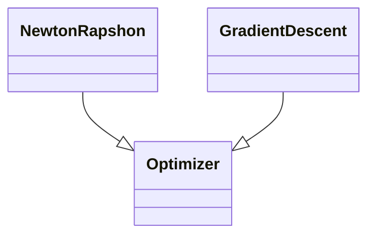
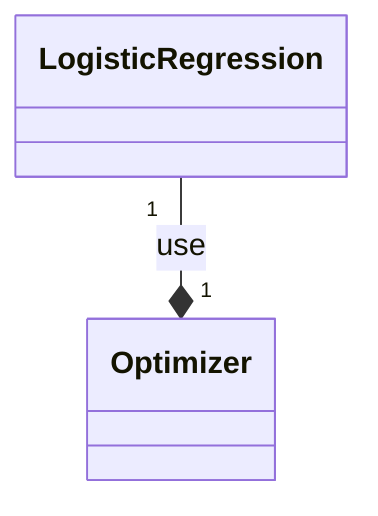

# Modelo
Buscamos encontrar un modelo que defina la relación lineal entre unas variables explicativas dadas (datos) y una respuesta dicotomica (variable de sí o no).
**Ejemplo:** Probabilidad de que una persona persona enferme **1** en que una persona enferme (1) o no (0) en función de su edad, sexo, hábitos relacionados con el alcohol etc.
Esto es conocido como un proceso #binomial , solo tenemos dos caminos, **"éxito"** o **"fracaso"** , la probabilidad de éxito se define por $p$ y su probabilidad de fracaso se define por $1-p$  (ambas probabilidades sumadas dan 1).
>[!prob] Odds
>#probabilidad
>El cociente $\dfrac{p}{1-p}$ indica cuanto más probable es el éxito que el fracaso.

## Objetivo
Encontrar si la probabilidad de éxito de una variable depende o no de otras variables.
Ejemplos:
- Probabilidad de un derrame cerebral teniendo en cuenta variables como: predisposición genetica, consumo de drogas, alcohol, edad, etc.

## Likehood (Verosimilitud)

### Maximum Likehood
**¿Qué valor del parámetro $(\beta)$ hace más probable haber observado exactamente estos datos?**
No buscamos conocer $p$ sino "adivinar" un $\beta$ el cual nos de la probabilidad de los datos
busca encontrar el conjunto de coeficientes que hace que los datos observados sean los más probables.
## La función Sigmoide (La útima capa)

El modelo de la regresión Logistica hace uso de un grupo de funciones conocidas  como funciones sigmoides (hay una matematica detras la cual busca encontrar en que vamos a evaluar la función sigmoide) tiene forma de S y convierte los valores limitandolos entre valores de 0 y 1.
**Ejemplos:**
- Función logística: $$\sigma(z) = \dfrac{1}{1+e^{-z}}$$ donde $z$ se define como los datos (modificados por una función)
- Tangente Hiperbólica (Tanh):$$tanh(x)=\dfrac{e^x-e^{-x}}{e^x+e^-x}=\dfrac{senh(x)}{cosh(x)}$$
	Donde su imagen esta en el dominio $[-1;1]$
- Arcotangente $f(x)=arctan(x)$
- Curva de Gompertz: $$f(t)=ae^{-be^{-ct}}$$
	- $a$ es una asíntota, ya que $$\lim_{t\to0}ae^{-be^{-ct}}=ae^0=a$$
	- _b_ establece el desplazamiento a lo largo del eje x (traduce el gráfico a la izquierda o derecha)
	- _c_ establece la tasa de crecimiento (escala _y_)
## Modelo aplicado en la SIgmoide
Realmente el modelo es $$z=\beta_0+\beta_1x_1+\cdots+\beta_nx_n$$
>[!scikit] De hecho, la regresión logística **es un modelo lineal**.
>La regresión Lineal y Lógistica pertenecen a los Modelos Lineales Generalizados (GLM)

y después:$$p=σ(z)$$
>[!numpy] Note que para encontrar el modelo puede hacer uso de una regresión por mínimos Cuadrados
>>[!python]- Cuando Realizamos Código de este estilo es util ver los paquetes y modulos por lo que son "¿Quién es responsable de esto?":
>>Ejemplos:
>>- Models se encarga del modelo, no hace cálculos de precisión, no sabe hace optimización, los métodos numericos en especifico se guardan dentro de su area, esto se hace con la intención de reutilizar los mismmos modelos
>>- 

# Arquitectura de un proyecto
La arquitectura de un proyecto puede ser más compleja de lo que se comenta, pero se puede definir en 3 preguntar para dar forma a las clases, Métodos, Modulos, Paquetes y incluso un UML  (para plasmar la arquitectura del programa).
## Preguntas
1. Dónde vive Cada Cosa?: Qué Paquetes dividen a los Modulos, ejemplo: Notebook almacena los Cuadernillos para hacer pruebas.
2. ¿Quién es responsable de qué?: Que Módulo se encarga de Optimizar
3. ¿Cómo se realiza el UML? Eso ya empieza a introducir relaciones UML como:
	- herencia
	- composición
	- agregación
	- dependencia

En el caso de este Proyecto se puede preguntar que tiene que hacer apenas reciba los datos (recibe los datos y los envía de una vez??), lo mejor sería realizar un **preprocesamiento**, muchas veces los datos en el Internet están *contaminados*

Tags: #sigmoide #binomial #probabilidad 