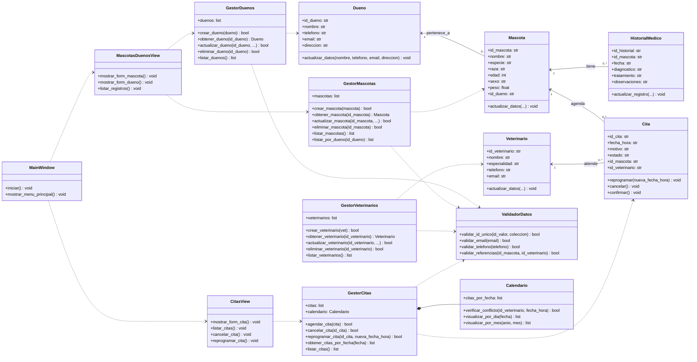

1. -Poke manager: CRUD con pokemons, python, interfaz gráfica-

```mermaid
classDiagram
direction LR

class Dueno {
  +id_dueno: str
  +nombre: str
  +telefono: str
  +email: str
  +direccion: str
  +actualizar_datos(nombre, telefono, email, direccion) void
}

class Mascota {
  +id_mascota: str
  +nombre: str
  +especie: str
  +raza: str
  +edad: int
  +sexo: str
  +peso: float
  +id_dueno: str
  +actualizar_datos(...) void
}

class Veterinario {
  +id_veterinario: str
  +nombre: str
  +especialidad: str
  +telefono: str
  +email: str
  +actualizar_datos(...) void
}

class Cita {
  +id_cita: str
  +fecha_hora: str
  +motivo: str
  +estado: str
  +id_mascota: str
  +id_veterinario: str
  +reprogramar(nueva_fecha_hora) void
  +cancelar() void
  +confirmar() void
}

class HistorialMedico {
  +id_historial: str
  +id_mascota: str
  +fecha: str
  +diagnostico: str
  +tratamiento: str
  +observaciones: str
  +actualizar_registro(...) void
}

class ValidadorDatos {
  +validar_id_unico(id_valor, coleccion) bool
  +validar_email(email) bool
  +validar_telefono(telefono) bool
  +validar_referencias(id_mascota, id_veterinario) bool
}

class GestorDuenos {
  +duenos: list
  +crear_dueno(dueno) bool
  +obtener_dueno(id_dueno) Dueno
  +actualizar_dueno(id_dueno, ...) bool
  +eliminar_dueno(id_dueno) bool
  +listar_duenos() list
}

class GestorMascotas {
  +mascotas: list
  +crear_mascota(mascota) bool
  +obtener_mascota(id_mascota) Mascota
  +actualizar_mascota(id_mascota, ...) bool
  +eliminar_mascota(id_mascota) bool
  +listar_mascotas() list
  +listar_por_dueno(id_dueno) list
}

class GestorVeterinarios {
  +veterinarios: list
  +crear_veterinario(vet) bool
  +obtener_veterinario(id_veterinario) Veterinario
  +actualizar_veterinario(id_veterinario, ...) bool
  +eliminar_veterinario(id_veterinario) bool
  +listar_veterinarios() list
}

class Calendario {
  +citas_por_fecha: list
  +verificar_conflicto(id_veterinario, fecha_hora) bool
  +visualizar_por_dia(fecha) list
  +visualizar_por_mes(anio, mes) list
}

class GestorCitas {
  +citas: list
  +calendario: Calendario
  +agendar_cita(cita) bool
  +cancelar_cita(id_cita) bool
  +reprogramar_cita(id_cita, nueva_fecha_hora) bool
  +obtener_citas_por_fecha(fecha) list
  +listar_citas() list
}

class MainWindow {
  +iniciar() void
  +mostrar_menu_principal() void
}

class MascotasDuenosView {
  +mostrar_form_mascota() void
  +mostrar_form_dueno() void
  +listar_registros() void
}

class CitasView {
  +mostrar_form_cita() void
  +listar_citas() void
  +cancelar_cita() void
  +reprogramar_cita() void
}

Dueno "1" <-- "0..*" Mascota : pertenece_a
Mascota "1" <-- "0..*" HistorialMedico : tiene
Mascota "1" <-- "0..*" Cita : agenda
Veterinario "1" <-- "0..*" Cita : atiende

GestorDuenos ..> Dueno
GestorMascotas ..> Mascota
GestorVeterinarios ..> Veterinario
GestorCitas ..> Cita
GestorCitas *-- Calendario

GestorDuenos ..> ValidadorDatos
GestorMascotas ..> ValidadorDatos
GestorVeterinarios ..> ValidadorDatos
GestorCitas ..> ValidadorDatos

MainWindow ..> MascotasDuenosView
MainWindow ..> CitasView
MascotasDuenosView ..> GestorMascotas
MascotasDuenosView ..> GestorDuenos
CitasView ..> GestorCitas
```
