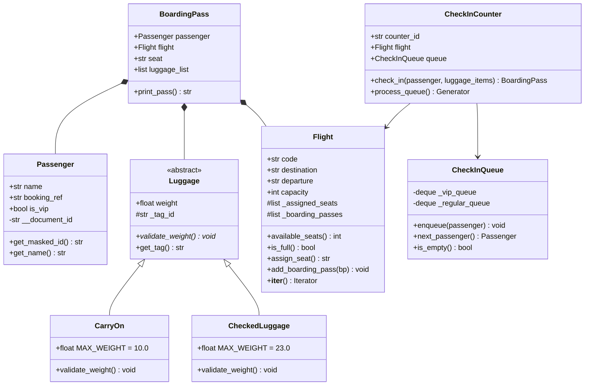

# Airport Check-In System: Estrategia y Arquitectura

## Misión

Construir una simulación robusta, orientada a objetos e impulsada por eventos para el flujo de check-in de un aeropuerto. El sistema garantiza encapsulamiento, manejo seguro de errores mediante excepciones personalizadas y un procesamiento eficiente utilizando colas de prioridad y generadores.

---

## Claves

1. **Abstracción y Contratos (`Luggage` como ABC):**
   Definir `Luggage` como una clase abstracta (`abc.ABC`) asegura que no existan instancias de equipaje sin un tipo definido y obliga a todas las subclases a implementar su propia lógica de validación de peso (`validate_weight()`).

2. **Encapsulamiento y Ocultamiento de Información (`Passenger` y `Flight`):**
   Los datos sensibles (como el número de documento) y los estados internos complejos (como el registro de pases de abordar) no se exponen directamente. Se gestionan mediante métodos de acceso (`get_masked_id()`) e interfaces de iteración (`__iter__()`).

3. **Manejo Controlado de Excepciones Propias (`exceptions.py`):**
   El sistema no interrumpe abruptamente su ejecución ante fallos de negocio. Modela situaciones del dominio real mediante excepciones dedicadas (`FlightFullError`, `OverweightLuggageError`, `EmptyQueueError`), separando la lógica de validación de la lógica de presentación.

4. **Colas de Prioridad Bidireccionales (`CheckInQueue`):**
   Implementa reglas de atención reales combinando dos estructuras FIFO (`collections.deque`). Garantiza que los pasajeros VIP siempre sean procesados antes que los pasajeros de la fila regular.

5. **Flujos Perezosos y Evaluación Bajo Demanda (`Generators` en `CheckInCounter`):**
   El proceso de check-in no acumula resultados en memoria. Utiliza la instrucción `yield` en el método `process_queue()` para procesar y entregar el resultado de cada pasajero individualmente a medida que es atendido.

---

## Preguntas Clave para el Equipo (Sanity Checks)

### Lógica de Negocio y Errores
- **¿Un pasajero rechazado consume un asiento del vuelo?**
  No. Si un pasajero falla la validación de equipaje (`OverweightLuggageError`), el proceso debe interrumpirse antes de ejecutar `assign_seat()`.
- **¿Cómo debe comportarse el iterador de `Flight`?**
  El método `__iter__(self)` debe permitir recorrer los pases de abordar emitidos sin exponer directamente la lista interna `_boarding_passes`. Se puede retornar `iter(self._boarding_passes)`.

### Gestión de Colas
- **¿Cómo evita `process_queue()` lanzar `EmptyQueueError` durante la ejecución normal?**
  `process_queue()` debe consultar si existen elementos en la cola VIP o en la regular antes de invocar `next_passenger()`. La excepción `EmptyQueueError` se reserva exclusivamente para llamadas directas e indebidas a `next_passenger()` cuando la estructura está vacía.

### Diagrama UML y Sintaxis Python
- **¿Cómo se representan los modificadores de acceso en UML frente a Python?**
  - Privado: `-` en UML, mapeado a `__atributo` en Python (ej. `__document_id`).
  - Protegido: `#` en UML, mapeado a `_atributo` en Python (ej. `_assigned_seats`).
  - Público: `+` en UML, mapeado a `atributo` o `metodo()` público en Python.

---

## Distribución Preliminar de Tareas por Tópicos

### Módulo 1: Core Domain y Encapsulamiento
- **Archivos:** `models.py`
- **Componentes:** `Passenger`, `Flight`
- **Entregables:**
  - Clase `Passenger` con atributo privado `__document_id` y método `get_masked_id()` utilizando slicing de cadenas.
  - Clase `Flight` con control de capacidad, asignación de asientos y soporte para el protocolo de iteración `__iter__()`.

### Módulo 2: Jerarquía de Clases y Polimorfismo
- **Archivos:** `models.py`
- **Componentes:** `Luggage`, `CarryOn`, `CheckedLuggage`
- **Entregables:**
  - Clase abstracta `Luggage` heredando de `abc.ABC` con `@abstractmethod validate_weight()`.
  - Subclase `CarryOn` (límite 10 kg).
  - Subclase `CheckedLuggage` (límite 23 kg).
  - Lógica para lanzar `OverweightLuggageError` en caso de exceso de peso.

### Módulo 3: Excepciones y Estructuras de Datos
- **Archivos:** `exceptions.py`, `queueing.py`
- **Componentes:** Excepciones personalizadas, `CheckInQueue`
- **Entregables:**
  - Definición de `FlightFullError`, `OverweightLuggageError` y `EmptyQueueError` heredando de `Exception`.
  - Clase `CheckInQueue` que administre `_vip_queue` y `_regular_queue` utilizando `collections.deque`.
  - Método `next_passenger()` con prioridad VIP y lanzamiento de `EmptyQueueError`.

### Módulo 4: Lógica de Servicio y Generadores
- **Archivos:** `models.py`, `counter.py`
- **Componentes:** `BoardingPass`, `CheckInCounter`
- **Entregables:**
  - Clase `BoardingPass` con método `print_pass()` para representación formateada.
  - Método `CheckInCounter.check_in()` para coordinar validación de equipaje y asignación de asiento.
  - Método generador `CheckInCounter.process_queue()` utilizando `yield` para procesar la fila elemento a elemento.

### Módulo 5: Integración, UML y Demostración
- **Archivos:** `main.py`, `README.md`, Diagrama UML
- **Componentes:** Script principal y documentación
- **Entregables:**
  - Diagrama de clases UML completo con tipos, multiplicidades y modificadores de acceso.
  - Script `main.py` protegido con `if __name__ == "__main__":` ejecutando todos los escenarios requeridos.
  - Verificación del paquete Python e historial de commits integrado.

# README.MD

# Airport Check-In System

Sistema de gestion de check-in y abordaje para un aeropuerto desarrollado en Python 3, aplicando principios avanzados de Programacion Orientada a Objetos (POO) como encapsulamiento, herencia, polimorfismo, abstraccion, excepciones personalizadas, estructuras de datos y evaluacion perezosa (generadores).

---

## Arquitectura y Estructura del Proyecto

El proyecto esta organizado como un paquete modular en Python (`airport/`) junto con un script de entrada principal (`main.py`):

```text
Airport-Checking/
├── airport/                # Paquete principal del dominio
│   ├── __init__.py         # Inicializador del paquete
│   ├── models.py           # Passenger, Flight, BoardingPass, Luggage (CarryOn, CheckedLuggage)
│   ├── queueing.py         # CheckInQueue con prioridad VIP
│   ├── counter.py          # CheckInCounter y procesamiento de colas
│   └── exceptions.py       # Excepciones personalizadas del sistema
├── main.py                 # Script integrador y demostracion de casos de uso
└── README.md               # Documentacion del repositorio
```


    ## Tecnologias y Conceptos Aplicados

- **Lenguaje:** Python 3.10+
- **Encapsulamiento:** Atributos privados (`__document_id`) y protegidos (`_assigned_seats`, `_boarding_passes`) para seguridad de datos.
- **Polimorfismo y Abstraccion:** Uso de `abc.ABC` y `@abstractmethod` en la jerarquia de equipajes (`Luggage`).
- **Estructuras de Datos:** Manejo de colas de doble extremo (`collections.deque`) para implementar prioridad VIP en la atencion.
- **Protocolos Iteradores:** Implementacion de `__iter__()` en la clase `Flight` para recorrer pases de abordar de forma limpia.
- **Generadores (`yield`):** Evaluacion perezosa en `process_queue()` dentro del mostrador.
- **Manejo de Excepciones:** Errores de dominio definidos en `exceptions.py` (`FlightFullError`, `OverweightLuggageError`, `EmptyQueueError`).

---

## Instalacion y Ejecucion

No se requieren dependencias externas para ejecutar el proyecto, solo una instalacion estandar de Python.

1. **Clonar el repositorio:**
   ```bash
   git clone [https://github.com/ngodoya/Airport-Checking.git](https://github.com/ngodoya/Airport-Checking.git)
   cd Airport-Checking
   ```
   **Ejecutar la demostracion principal:**
```bash
python main.py
```
## Casos de Uso Demostrados en `main.py`

Al ejecutar el script principal, se validan de forma automatica los siguientes flujos de negocio:

1. **Prioridad VIP:** Procesamiento preferencial de pasajeros con flag `is_vip=True` independientemente de su orden de llegada.
2. **Validacion de Equipaje:** Rechazo de atencion por `OverweightLuggageError` al superar los limites de peso permitidos (10 kg en equipaje de mano, 23 kg en bodega).
3. **Emision de Boarding Pass:** Generacion de pase de abordar visual con datos de documento enmascarados (ejemplo: `******4050`).
4. **Control de Capacidad:** Captura de `FlightFullError` al intentar registrar mas pasajeros de la capacidad permitida por el vuelo.
5. **Iteracion de Vuelo:** Recorrido mediante ciclo `for` sobre la lista de pases del vuelo utilizando el iterador del objeto.
6. **Manejo de Cola Vacia:** Captura de `EmptyQueueError` al solicitar atencion sin clientes en espera.