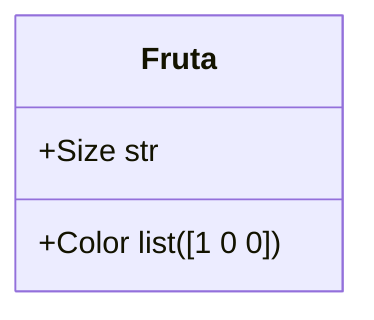
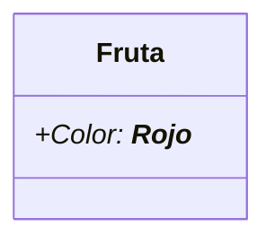
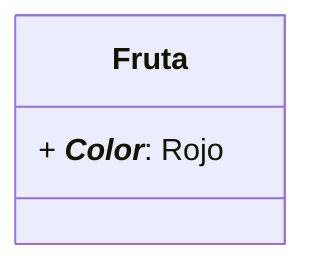
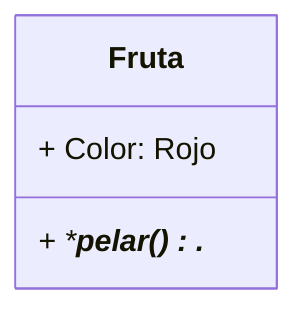

Una #clase es una plantilla para crear objetos, donde se define un tipo de objeto especificando sus atributos y sus comportamientos (métodos).
>[!Example] Cómo se ve una clase?
>- Clase Fruta, puede tener atributos, como color, tamaño, sabor y acciones como madurar()
>	- Objeto?? podemos hablar de una manzana



## Objeto
Un objeto es una ==instancia== de una clase, posee atributos definidos por su clase y puede utilizar los métodos dados por ella (Padre e hijo). Puede remitirse al ejemplo de la clase fruta y su #instancia **manzana**, existen ejemplos más complejos como lo pueden ser la clase **vehiculo** y instancia **automovil** , con atributos más complejos como lo son:
- Color: Rojo
- Locomoción por motor de combustión
Métodos:
* Encender
* Frenar
* Apagar
---
## OOP (Diseño Orientado a Objetos)
Nos enfocamos en abstraer atributos y comportamientos, basándonos en objetos del mundo real, la #abstracción resulta en algo relevante para modelar clases y objetos ya que buscamos traer la idea del mundo real a nuestra virtualidad, ignorando los conceptos especificos y trayendo los aspectos más generales, el ejemplo del automovil es perfecto para la situación, ya que abstraemos la idea general de avanzar, frenar y apagar sin necesidad de ir a su funcionamiento interno, puede verse el ejemplo de las black box.
![[Pasted image 20260421152306.png]]
## Datos, Atributos y Comportamiento
**Dato:** valor en concreto que toma un atributo en un objeto x.
Ejemplo:

En esta caso el Dato es lo especifico del objeto
**Atributo:** Valor general que comparten los objetos de la clase.
Ejemplo:

**Comportamientos (Métodos):** Las acciones que el objeto puede realizar.
Ejemplo:

---
## Herencia y Composición
La #herencia permite que una clase *(Hija)* herede atributos y métodos de una clase *(Padre)*, evitando caer en el #DRY , la composición permite y facilita crear clases complejas teniendo en cuenta la inclusión de objetos de otras clases, teniendo una relación de que A contiene con B, pero B no existe sin A.
### Diferencias:
- La herencia se puede definir como ***es un/a*** (Ej: Charizard es un Pokemon, los Tipo Fuego son un Pokemon). Tiene la ventaja de que podemos crear métodos propios de la nueva clase, por ejemplo A tiene n métodos, pero B puede tener n+1 métodos, como las Aves pueden ser la clase principal, pato puede heredar todo lo que tenga Aves, pero puede tener un método propio como *nadar()*
- Se puede ver como una relación de ***tiene un/a*** (Ej: Entreador tiene un Item, esto sería composición si los items dejaran de exitir al tiempo que deja de existir el entrenador). La clase Coche puede contener un objeto como atributo, el cual puede ser Motor, lo que permite =="absorber"== los métodos del motor, como ==arrancar_motor()==
---
### UML
Revise las relaciones que se pueden realizar en los diagrama UML [Relaciones](https://mermaid.js.org/syntax/classDiagram.html#defining-relationship).
# Clases y Objetos Python
>[!tip] Curiosidad y Repaso
>Incluso los Datos primitivos en Python son un objeto, como lo son ```str```,  ```bool```, ```int```, ```float``` etc.
>Un objeto es una instancia de una clase, que a su es una plantilla para crear objetos.

Es relevante señalar que un objeto sigue las especificaciones de su clase respectiva, no se puede salir de la cuadricula por decirlo así, también hay que añadir que cada instancia tiene sus propios atributos (o incluso metodos si se pasan distintos argumentos).
## Definiciones:
**Instanciar:** En python instanciar un objeto es crear un objeto único a partir de una clase. Los objetos tienen tanto datos **(atributos)** como código **(métodos)**.
*Objeto especifico creado a partir de una clase*
**Clase:** Plano o *Template* que define los atributos y métodos que sus objetos (instancias) tendran.
Existe un concepto un poco avanzado que se vera más adelante, que es crear varios objetos a partir de una sola clase, esto permite reutilizar y facilitar código (#DRY)

##  Clases Python
>[!Example]- Protip
>Utilizamos `CamelCase`, para crear la clase más básica en python solo es necesario utilizar la palabra clave pass, pass permite crear un bloque de código vació sin la necesidad de caer en el error de tener un bloque de código sin definir.
>```python
>class MyFirstClass:
>	pass
>```
## Atributos de Clase
Los atributos de clase se pueden ver como **variables**  de los objetos en python, los atributos en las clases son las variables especificas asociadas a la clase misma, no a las instancias, todas las instancias que se crean a partir de la clase, tienen estas variable *(atributos)*, se definen en el cuerpo de la clase fuera de cualquier metodo, se pueden definir de la siguiente manera:
```python
class Point:
	definition: str = "Entidad Geometrica que representa una ubicación en el espacio"
point = Point()
print(point.definition)
```
## Atributos de Instancia
Y si queremos que cada instancia tenga algo que las diferencie? los atributos de instancia se pueden ver como variables específicas de cada instancia de una clase (esto no limita que haya dos objetos con los mismos atributos de instancia). Se definen dentro del método `__init__`, utilizando el prefijo `self` para explicar y definirlos como atributos de instancia (el objeto único).

```python
class Point:

	DEFINITION: str = "Entidad geometrica abstracta que representa una ubicación en un espacio."

	def __init__(self, x: float =0, y: float = 0 ) -> None:
		self.x = x
		self.y = y
point = Point()

point2 = Point(3, 4)

print(point.definition, point.x, point.y)

print(point2.definition, point2.x, point2.y)
```
Note que incluso para llamar la definition, no es necesario llamar point2.definition, puede usar el mismo de point.definition, debido a que es una variable especifica de la clase.
## Inicializacion (`__init__`) y el si mismo (`self`)
Instanciar un objeto implica llamar a la clase, como si fuera una función, esto implica pasar valores por su método #constructor ``__init__``. Este método ==inicializa== los objetos, sus métodos y sus atributos, teniendo una configuración inicial.
- `__init_` es el método de inicialización de una clase, es importante utilizarlo para darle un estado inicial al objeto.
- Nunca devuelve un valor, su proposito es definir la instancia: `def __init__(self) -> None:`
En python `self` es un termino utilizado para referirse a la instancia actual de la clase, no es una palabra reservada por python, pero si es una *"regla general"* ya que viene de una creencia bastante arraigada, es demasiado util para pasar información en la clase, ya que se reconoce la instancia, sabe quien es y como funciona y se diferencia de los otros objetos, sin necesidad de pasar una cantidad engorrosa de datos entre la misma clase. Su utilidad se basa en poder diferenciar variables locales y globales, además de reconocer el estado (atributos) de la instancia dada, sin self no existiria una ofrma de acceder a los datos desde adentro de los métodos de la clase
## Métodos
Ya se conoció el primer método relevante, que es el inicializador, se definen como funciones dentro de la estructura de la clase, cualquier funcionalidad que se quiera atribuir a la clase, es simple como añadir más métodos.
>[!Example]- 
>```mermaid
>classDiagram
>class Point {
>+str definition
>+int x
>+int y
>+__init__(x, y)
>+reset()
>+move()
>}
>```

```python
class Point:

    definition: str = "Entidad geometrica que representa una ubicación en el espacio"

    def __init__(self, x: float, y: float) -> None:

        self.x = x

        self.y = y

    def move(self, new_x: float, new_y: float) -> "Point":

        self.x = new_x

        self.y = new_y

        return self

    def reset(self) -> "Point":

        self.x = 0

        self.y = 0

        return self
point = Point(5, 4)

print(point.definition, point.x, point.y)

point.move(4, 5)

print(point.x, point.y)

point.reset()

print(point.x, point.y)

```

## Objetos como argumentos
Como se vio todo en Python son objetos, de manera que los métodos de una clase y la clase en sí pueden recibir argumentos tipo objeto.
Para el ejercicio anterior agregue el método que calcula la distancia
```python
def compute_distance(self, point: "Point") -> float:

	distance = ((self.x - point.x)**2 + (self.y - point.y)**2) ** (1/2)

    return distance
```
>[!Example]- **Ejercicio:** 
>Defina una clase siguiendo la siguiente estructura:
>- _specie_: Class attribute
>- _age_, _name_: Instance attributes
>- greet(): should print-> , is gretting you!
>- is_older_than(Person)->bool: Dtermine if the instance person is older than the argument person.

>[!check]- Solución
>```python
>class Person:
>	specie: str = "Homosapien" #Atributo de Clase
>	def __init__(self, age: int, name: str) -> None:
>		self.age = age #Atributos de Instancia
>		self.name = name
>	def greet(self) -> None:
>		print(f"{self.name} is greeting you")
>	def is_older_than(self, person: "Person") -> bool:
>		return self.age > person.age
>person1 = Person(18, "Manuel")
>person2 = Person(20, "Sara")
>person1.greet()
>person2.greet()
>print(person1.is_older_than(person2))
>print(person2.is_older_than(person1))
>```


Tags: #clase #instancia #abstracción #DRY #herencia #constructor 
