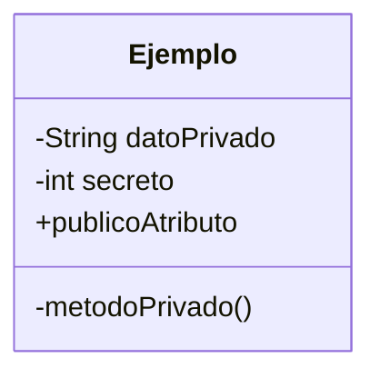
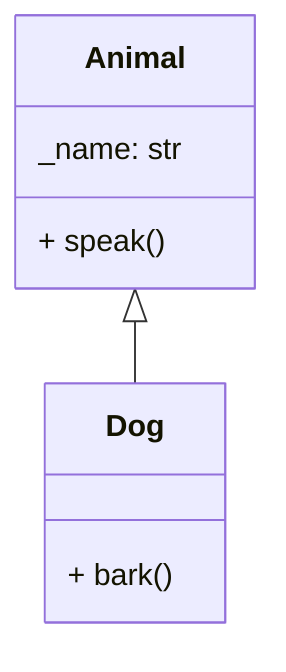
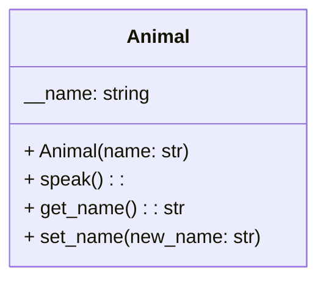

Busca Privatizar el acceso a ciertos datos o métodos, esto facilita y permite el manejo y gestión correcta de que métodos pueden ser publicos y podríamos tener acceso directo a su manejo:[[]]
>[!Example]- Clase Personaje
>```python
>def class Personaje:
>	def __init__(self, ....) -> None:
>	pass
>	def Turno(Self):
>	pass
>	def Atacar():
>	pass
>	def Mover()
>	pass
>	
>```

>[!Important] Prefijos
>los métodos en python suelen dejarse con `get` para acceder, y `set` para modificar

- *psdt: Note que suele ser relevante el hecho de que al definir atributos de forma publica, se pueden modificar libremente sin necesidad de métodos, esto puede ser contraproducente, por ello mismo existe el **encapsulamiento***
En los diagramas UML se pueden visualizar de la siguiente manera:


## Ventajas
- **Protección de Datos:** Usualmente se pueden modificar datos de manera no intencional lo cual puede ser catastrófico para nuestro código, el encapsulamiento facilita esto
- **Facilita el manejo de versiones futuras:** cómo hay código *"Oculto"* esto evita la complejidad de tener que remitirse a todo el código.
- **Mejora la seguridad:** Protege información sensible de objetos, contraseñas, numeros de cuenta, documentos de identidad, etc.
## Encapsulamiento en Python
Python en terminos de encapsulamiento puede considerarse más débil para encapsulamiento que otros lenguajes de programación como lo son C++ o Java, pero tiene su adaptación que termina siendo util aunque conlleve otra filosofia, OJO, ***no*** es un mecanismo de #encapsulamiento puro:
- `(+) Public:`  Por defecto los atributos de una clase, siempre seran publicos
- `(_) Protected:` Se indica con un prefijo de un guion bajo. Son accesibles dentro de la clase y sus subclases,  es una *notación* no una restricción del mensaje.
- `(__) Private`Se indica con un prefijo de dos guiones bajos. Python realiza un cambio de nombre (name mangling) para hacerlos inaccesibles desde fuera, es burlable, pero es util
### Ejemplos




```python
# Private
class Animal:
  def __init__(self, name):
    self.__name = name

  def speak(self):
    print(f"El animal {self.__name} dice algo")

  def get_name(self):
    return self.__name

  def set_name(self, new_name es):
    if new_name:
      self.__name = new_name


animal = Animal("Gato")
animal.speak()
# try
# print(f"Nombre del animal: {animal.__name}")
animal.get_name()

# Se modifica el nombre usando métodos privados
animal.set_name("Michi")
animal.speak()
```
--- 
### Forma de analizar Privados
`_Animal__name:` lo que hace python del `name mangling` se puede visualizar internamente como
``__name`` $\rightarrow$ ``_Animal__name``, realmente lo que hace es dificultar el acceso por accidente, aquí aplica el hecho de *Python es bueno en muchas cosas, pero no es bueno en todo*.
```python
print(f"Nombre del animal: {animal.get_name()}")

print(f"Nombre del animal: {animal._Animal__name}") # Son iguales pero no es usual acceder de esta forma
```
**Ejemplo:**
```python
import uuid

  

class BankAccount:

  def __init__(self, balance):

    self.__balance = balance

    self.__password = ''

    self.__code = uuid.uuid4()

  

  def deposit(self, amount):

    if amount > 0:

      self.__balance += amount

      return True

    else:

      return False

  

  def withdraw(self, amount):

    if amount > 0 and amount <= self.__balance:

      self.__balance -= amount

      return True

    else:

      print("El monto a retirar no puede ser mayor al saldo actual")

      return False

  

  def get_balance(self):

    return self.__balance

  

  def get_code(self):

    self.__code = uuid.uuid4()

    return self.__code

  

  def set_password(self, code, password):

    if self.__code == code and not self.__password:

      self.__password = password

      return True, '*'*len(self.__password)

    else:

      return False, ''

  def _check_password(self, password):

    return self.__password == password

  

  def set_balance(self, new_balance, password):

    if self._check_password(password): # El método set_balance utiliza el metodo check_password para verificar la contraseña

      # por notanción el método _check_password es privado, lo que indica que no debe ser accedido desde fuera de la clase,

      #  pero puede ser utilizado dentro de la clase para verificar la contraseña antes de modificar el saldo.

      self.__balance = new_balance

      return True

    else:

      return False

  

account = BankAccount(balance=1000)

code = account.get_code()

account_password = "123456"

result, chars = account.set_password(code, account_password)

print(result, f"New pass {chars}")

account.deposit(500)

account.withdraw(300)

current_balance = account.get_balance()

print(f"Saldo actual: {current_balance}")

  

# Modificación del saldo con contraseña incorrecta

print(account.set_balance(2000, "123"))
```
Es un buen ejemplo que explica como manejar la protección y privatización de datos, esto se puede ejemplificar en el método ``_chech_password`` el cual solo puede ser utilizado dentro de la misma clase o subclases, evitando el name mangling de python.
## Setters y Getters
Como los atributos privados en un clases no son accesibles fuera de ella existen estos, métodos, los cuales se utilizan de las siguiente manera:
- **Setters:** Se utiliza para cambiar valores dentro de atributo privado, por ejemplo `set_<nombre_variable>(valor)`
- **Getters** Se encarga de llamar valores o un valor privado, por ejemplo `get_<nombre_variable>`
>[!note] **Nota importante:**
> Sí se puede acceder a los atributos protegidos de una instancia en Python, pero hacerlo va en contra de las convenciones de la programación orientada a objetos. Esta convención señala a otros programadores que el atributo está destinado para uso interno dentro de la clase o en subclases, pero técnicamente sigue siendo accesible desde fuera de la clase.

## Encapsulamiento y herencia
La herencia puede complicar el encapsulamiento especialmente cuando se trabaja con atributos protegidos y privados. Los atributos protegidos son accesibles en subclases, pero los privados no lo son directamente.

```python
class Vehicle:
  def __init__(self, make):
    self._make = make  # Protegido

class ElectricVehicle(Vehicle):
  def __init__(self, make, battery_range):
    super().__init__(make)
    self.battery_range = battery_range  # Público

  def get_make(self):  # Getter para atributo protegido de la superclase
    return self._make

  def get_battery_range(self):  # Getter para atributo propio
    return self.battery_range
```


Tags: #encapsulamiento 