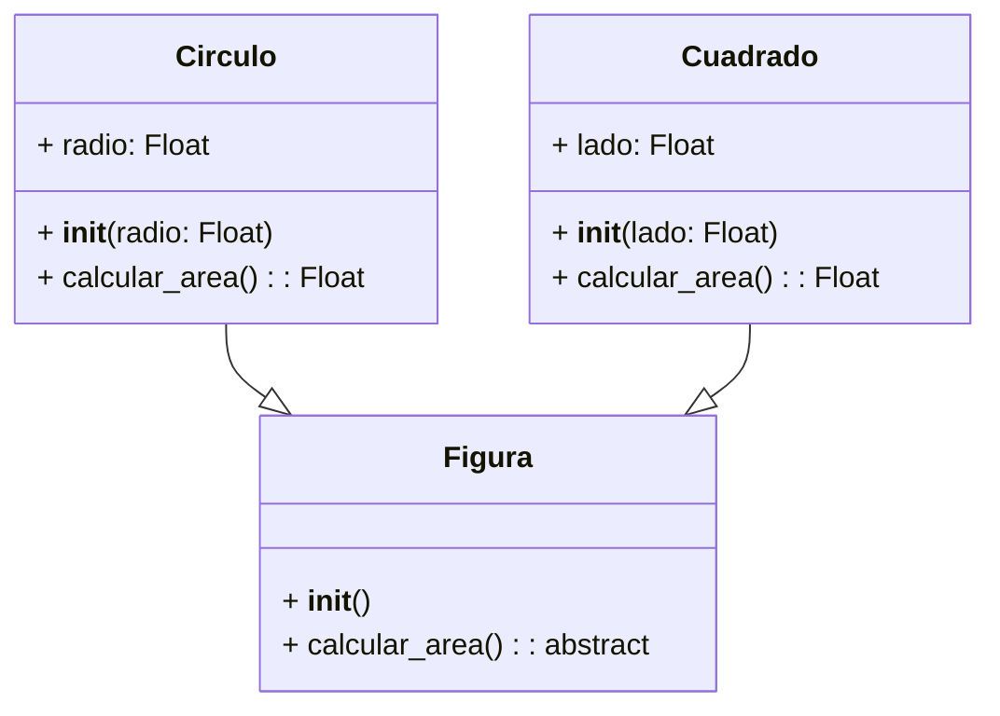
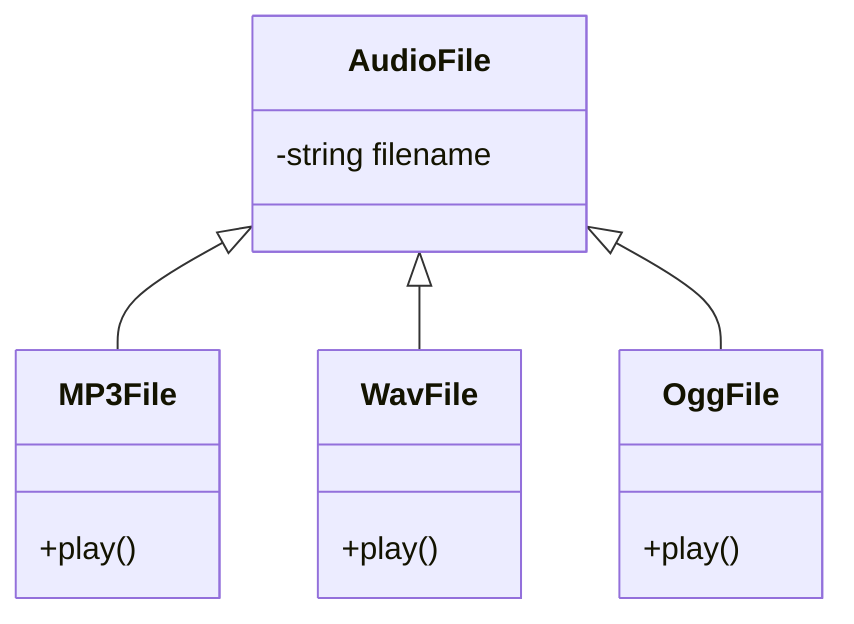

Proviene de *(varias formas)*, es una extensión en esencia lograda gracias a la esencia, permite que varios objetos utilicen un mismo método de distintas formas, puede ser confuso pero extremadamente util a la hora de programar:
- **Extensibilidad:** Facilita la extensión del código al permitir _agregar nuevas funcionalidades_ sin necesidad de modificar las clases existentes.
- **Flexibilidad:** Al utilizar _interfaces_ o clases base polimórficas, se puede cambiar la implementación concreta sin necesidad de alterar el código que utiliza estas abstracciones.
**Ejemplo**:

```python
class Figura:
  def __init__(self):
    pass

  def calcular_area(self):
    # Solo para ser estrictos, también se podría poner un pass
    raise NotImplementedError("Subclases deben implementar area()")

class Cuadrado(Figura):
  def __init__(self, lado):
    super().__init__()
    self.lado = lado

  def calcular_area(self):
    return self.lado * self.lado

class Circulo(Figura):
  def __init__(self, radio):
    super().__init__()
    self.radio = radio

  def calcular_area(self):
    return 3.14 * self.radio * self.radio


figura1 = Cuadrado(5)
figura2 = Circulo(3)

print(f"El area del cuadrado es: {figura1.calcular_area()}")
print(f"El area del circulo es: {figura2.calcular_area()}")
```
En este ejemplo, la clase Figura es la clase base y define el método abstracto calcular_area(). Las clases Cuadrado y Circulo heredan de Figura e implementan su propio comportamiento para el método `calcular_area()`. Cuando llamamos al método `calcular_area()` en un objeto de cualquiera de las subclases, se ejecuta la implementación correspondiente a esa clase.
## Duck_typing
Es remitirnos a quitar la necesidad de verificar o analizar en gran medida el objeto, *es lo que hace*, esto que implica? Implica que nuestro interés real esta en las funciones (métodos) del objeto, en un ejemplo proximo veremos que se traduce como un, si puede  reproducir audio es un archivo de audio, así sea un mp3, nuestra utilidad viene del polimorfismo.
**Ventajas:**

- Permite escribir funciones y métodos más genéricos
- No es necesario que las clases compartan una jerarquía de herencia
El _Duck Typing_ en Python facilita el #polimorfismo al centrarse en lo que los objetos pueden hacer en lugar de en lo que son *(ignorando la idea de, es un/una)*.


este ejemplo usa herancia pero en esencia no es necesario.
# Modulos y Paquetes
Correr todo un código en un solo archivo de python puede ser sencillo (lo hemos hecho hasta ahora) pero cuando los archivos crecen y crecen, es necesario realizar su respectiva organización en modulos y paquetes para mantener su entendimiento y legibilidad.
## Modulos
Los modulos en python se sostienen de traer la base del código, clases, funciones y variables para utilizarlas en el nuevo proyecto *(son el corazón del código)*, se puede ver como **objetos** (ya que python los trata así) pero son archivos `.py` , ejemplos de modulos.
```python
import numpy as np
import pandas as pd
import matplotlib.pyplot as plt # no llamamos todo para evitar utilizar cosas innecesarias :D **submódulo**
import operaciones
```
```python
# archivo: operaciones.py
def suma(a, b):
    return a + b
```
cuando se importa, el módulo se comporta como un objeto que contiene atributos (funciones, clases, variables)
## Paquete
Es la colección de modulos agrupado en una carpeta, tiene el plus que requiere tener el archivo especial llamado `__init__py` 
**Ejemplo:**
```
estructura_archivos/
├── paquete/
│   ├── __init__.py
│   ├── saludar.py
│   └── despedirse.py
└── main.py
```
```
# main.py
import paquete.saludar as saludar
import paquete.despedirse as despedirse

def main():
  nombre = "Juan"
  saludo = saludar.Saludar(nombre)
  despedida = despedirse.Despedirse(nombre)
  print(saludo.saludar_casual())
  print(saludo.saludar_formal())
  print(saludo.saludar_educado())
  print(saludo.saludar_cordial())
  print(despedida.despedirse_formal())
  print(despedida.despedirse_casual())
  print(despedida.despedirse_educado())
  print(despedida.despedirse_cordial())

if __name__ == "__main__":
  main()  
```
```
# saludar.py
class Saludar():
  def __init__(self, nombre:str):
      self.nombre = nombre
  def saludar_casual(self):
    return f"Hola {self.nombre}"
  def saludar_formal(self):
    return f"Buenos días {self.nombre}"
  def saludar_educado(self):
    return f"Un placer saludarte {self.nombre}"
  def saludar_cordial(self):
    return f"Que gusto verte {self.nombre}" 
```
```
# despedirse.py
class Despedirse:
  def __init__(self, nombre:str):
    self.nombre  = nombre
  
  def despedirse_formal(self):
    return f"Adios {self.nombre}"
  
  def despedirse_casual(self):
    return f"Chao {self.nombre}"
  
  def despedirse_educado(self):
    return f"Hasta luego {self.nombre}"
  
  def despedirse_cordial(self):
    return f"Nos vemos {self.nombre}" 
```
### Ventajas
Las más obvias son:
- **Organización**
- **Re utilización**
- **Mantenimiento**
- **Legibilidad**
---
### Tipos de Imports
Básicamente una ruta especifica del camino completo desde el directorio raíz del proyecto, básicamente como cuando empezamos a usar la terminal y utilizamos `cd` en rutas exactas.
**Ejercicio:** 
Importe el siguiente modulo (database)
```
ecommerce/
│   __init__.py
│   main.py
│
├── database/
│   │   __init__.py
│   │   database.py
│
└── products/
    │   __init__.py
    │   products.py

```
>[!check]- Solución
>```python
># Products
>from ecommerce.database.database import Database
>```

Son el estandar en #PEP8 siempre y cuando no generen expresiones muy largas.
### Importaciones Relativas
Los imports relativos utilizan puntos para indicar el módulo actual o el directorio de paquetes. Son útiles para importar entre paquetes y módulos dentro de una misma aplicación sin necesidad de nombrar el paquete raíz (Misma carpeta).
```python 
	from .database import Database
```


## `__name__ == "__main__"`
Tags: #Imports #Polimorfismo #PEP8 