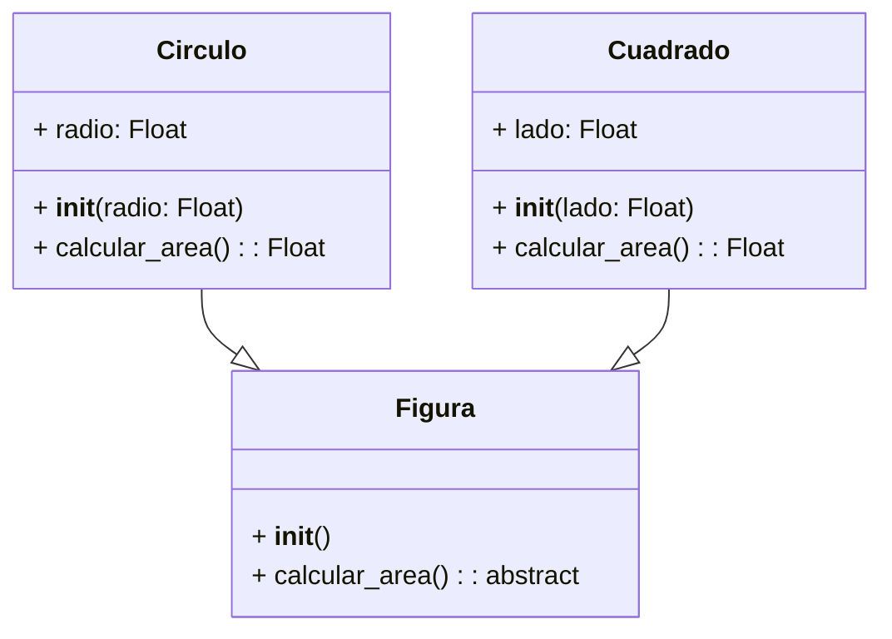

Proviene de *(varias formas)*, es una extensión en esencia lograda gracias a la esencia, permite que varios objetos utilicen un mismo método de distintas formas, puede ser confuso pero extremadamente util a la hora de programar:
- **Extensibilidad:** Facilita la extensión del código al permitir _agregar nuevas funcionalidades_ sin necesidad de modificar las clases existentes.
- **Flexibilidad:** Al utilizar _interfaces_ o clases base polimórficas, se puede cambiar la implementación concreta sin necesidad de alterar el código que utiliza estas abstracciones.
**Ejemplo**:

```python
class Figura:
  def __init__(self):
    pass

  def calcular_area(self):
    # Solo para ser estrictos, también se podría poner un pass
    raise NotImplementedError("Subclases deben implementar area()")

class Cuadrado(Figura):
  def __init__(self, lado):
    super().__init__()
    self.lado = lado

  def calcular_area(self):
    return self.lado * self.lado

class Circulo(Figura):
  def __init__(self, radio):
    super().__init__()
    self.radio = radio

  def calcular_area(self):
    return 3.14 * self.radio * self.radio


figura1 = Cuadrado(5)
figura2 = Circulo(3)

print(f"El area del cuadrado es: {figura1.calcular_area()}")
print(f"El area del circulo es: {figura2.calcular_area()}")
```
En este ejemplo, la clase Figura es la clase base y define el método abstracto calcular_area(). Las clases Cuadrado y Circulo heredan de Figura e implementan su propio comportamiento para el método `calcular_area()`. Cuando llamamos al método `calcular_area()` en un objeto de cualquiera de las subclases, se ejecuta la implementación correspondiente a esa clase.
## Duck_typing