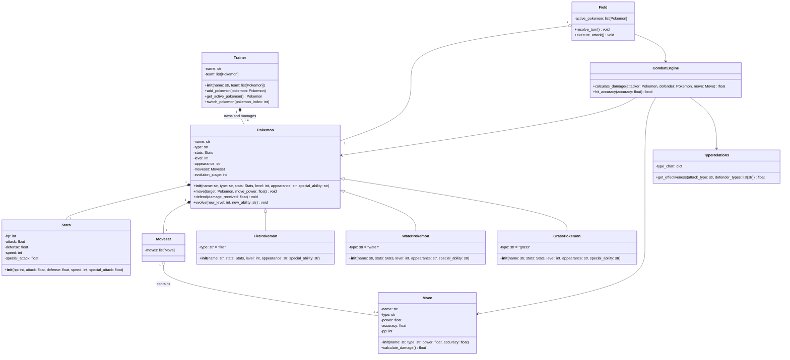

```mermaid
classDiagram
Trainer "1" *-- "1..6" Pokemon : owns and manages
Pokemon "1" *-- "1" Stats
Pokemon "1" *-- "1" Moveset
Moveset "1" o-- "0..4" Move : contains
CombatEngine --> Pokemon
CombatEngine --> Move
CombatEngine --> TypeRelations

class Trainer{
  -name: str
  -team: list[Pokemon]

  +__init__(name: str, team: list[Pokemon])
  +add_pokemon(pokemon: Pokemon)
  +get_active_pokemon() Pokemon
  +switch_pokemon(pokemon_index: int)
}

class Pokemon{
    -name: str
    -type: str
    -stats: Stats
    -level: int
    -appearance: str
    -moveset: Moveset
    -evolution_stage: int

    +__init__(name: str, type: str, stats: Stats, level: int, appearance: str, special_ability: str)
    +move(target: Pokemon, move_power: float) void
    +defend(damage_received: float) void
    +evolve(new_level: int, new_ability: str) void
}

class Stats{
    -hp: int
    -attack: float
    -defense: float
    -speed: int
    -special_attack: float

    +__init__(hp: int, attack: float, defense: float, speed: int, special_attack: float)
}

class Move{
    -name: str
    -type: str
    -power: float
    -accuracy: float
    -pp: int

    +__init__(name: str, type: str, power: float, accuracy: float)
    +calculate_damage() float
}

class Moveset{
    -moves: list[Move]
}

class CombatEngine{
    +calculate_damage(attacker: Pokemon, defender: Pokemon, move: Move) float
    +hit_accuracy(accuracy: float) bool
}

class TypeRelations{
    -type_chart: dict

    +get_effectiveness(attack_type: str, defender_types: list[str]) float
}

Pokemon <|-- FirePokemon
Pokemon <|-- WaterPokemon
Pokemon <|-- GrassPokemon

class FirePokemon{
    -type: str = "fire"

    +__init__(name: str, stats: Stats, level: int, appearance: str, special_ability: str)
}

class WaterPokemon{
    -type: str = "water"

    +__init__(name: str, stats: Stats, level: int, appearance: str, special_ability: str)
}

class GrassPokemon{
    -type: str = "grass"

    +__init__(name: str, stats: Stats, level: int, appearance: str, special_ability: str)
}

Field "1" o-- "2" Pokemon
Field --> CombatEngine

class Field{
    -active_pokemon: list[Pokemon]

    +resolve_turn() void
    +execute_attack() void
}

```
## Ideas
### Alternativa 1

- Pet Manager (GUI)
- SIA (Administrador de Cursos)
- 