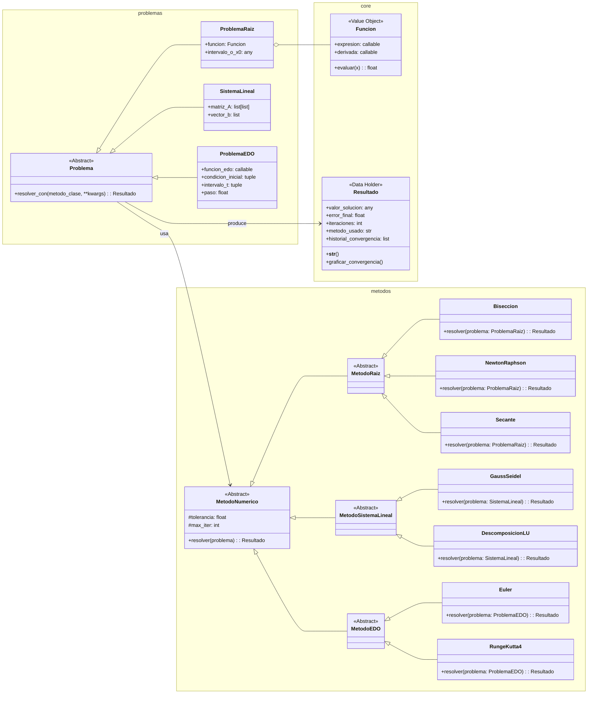

# Alternativa 6

## Construir una aplicación orientada a objetos para la solución de problemas mediante métodos numéricos utilizando Python.

La aplicación deberá permitir resolver distintos tipos de problemas matemáticos y de ingeniería utilizando algoritmos numéricos implementados bajo un enfoque de Programación Orientada a Objetos (POO).

El proyecto debe emular la estructura básica de una librería de computación científica, permitiendo modelar problemas, aplicar métodos de solución y visualizar resultados.

---

# Condiciones

- Código original
- Uso de herramientas vistas en el curso (CLASES)
- Interacción y manejo a través de consola (GUI opcional)
- El desarrollo debe realizarse completamente bajo enfoque POO
- El código debe estructurarse en forma de paquete

---

# Operaciones mínimas requeridas

## Modelado de problemas numéricos

La aplicación deberá permitir representar diferentes tipos de problemas matemáticos mediante clases.

Ejemplos:

- Problemas de raíces de ecuaciones
- Sistemas de ecuaciones lineales
- Problemas de ecuaciones diferenciales ordinarias (EDOs)

---

# Métodos numéricos mínimos

## Raíces de ecuaciones

Implementar al menos dos de los siguientes métodos:

- Bisección
- Newton-Raphson
- Secante

---

## Sistemas lineales

Implementar al menos uno de los siguientes métodos:

- Gauss-Seidel
- Descomposición LU

---

## Ecuaciones diferenciales ordinarias (EDOs)

Implementar al menos uno de los siguientes métodos:

- Euler
- Runge-Kutta de cuarto orden (RK4)

---

# Requisitos de POO

La implementación debe incorporar:

- Clase abstracta base para métodos numéricos
- Herencia entre métodos específicos
- Encapsulación de atributos como:
  - tolerancia
  - error
  - número máximo de iteraciones
  - función objetivo
- Uso de composición para modelar problemas y solucionadores
- Métodos especializados para:
  - resolver
  - calcular error
  - mostrar resultados
  - validar convergencia

---

# Resultados y visualización

La aplicación deberá:

- Mostrar iteraciones del método
- Reportar errores absolutos y relativos
- Mostrar criterio de convergencia
- Generar tablas de resultados
- Generar gráficas de convergencia y comportamiento numérico

Ejemplos:

- Error vs iteraciones
- Comparación entre métodos
- Aproximación de soluciones

---

# Features extra

## Persistencia y manejo de archivos

- Guardar resultados en archivos CSV o JSON
- Exportar reportes automáticos

---

## Comparación de métodos

Permitir resolver un mismo problema utilizando distintos métodos y comparar:

- precisión
- velocidad de convergencia
- número de iteraciones

---

## Validación numérica

Comparar resultados obtenidos con:

- soluciones analíticas conocidas
- librerías científicas como:
  - SciPy
  - NumPy

---

## Visualización avanzada (Bonus)

- GUI
- Animaciones de convergencia
- Gráficas interactivas
- Manejo de múltiples problemas simultáneamente

---

# Referencias sugeridas

- Numerical Methods for Engineers — Chapra & Canale
- Numerical Analysis — Burden & Faires
- SciPy Documentation
- SymPy Documentation
- Curso "Practical Numerical Methods with Python" — Lorena Barba

---

# Ejemplo de estructura del proyecto

```text
numerical_solver/
│
├── core/
│   ├── metodo_numerico.py
│   ├── resultado.py
│
├── problemas/
│   ├── raiz.py
│   ├── sistema_lineal.py
│   ├── edo.py
│
├── metodos/
│   ├── biseccion.py
│   ├── newton.py
│   ├── gauss_seidel.py
│   ├── runge_kutta.py
│
├── utils/
│   ├── parser.py
│   ├── graficas.py
│
├── tests/
│
├── main.py
├── requirements.txt
└── README.md
```

---

# Condiciones de entrega

## Entregable final

Se deberá elaborar un repositorio donde se presente:

- Explicación del problema y solución propuesta
- Diagramas UML y diagramas de clases
- Instrucciones de instalación y ejecución
- Estructura organizada como paquete Python
- Archivo `requirements.txt`
- Evidencia del trabajo colaborativo mediante commits y colaboradores

---

# Opcional

- GUI
- Docker
- Manejo de hilos
- Comparación automática entre métodos
- Reportes en PDF

---

# Nota

## Avance (15%)

Definición de:

- alcance del proyecto
- diagramas de clases
- estructura preliminar
- demostración funcional inicial

---

## Entrega Final (25%)

Criterios de evaluación:

- Funcionalidad (45%)
- Calidad del repositorio (30%)
- Claridad de la presentación (20%)
- Bonus (5%)


	
