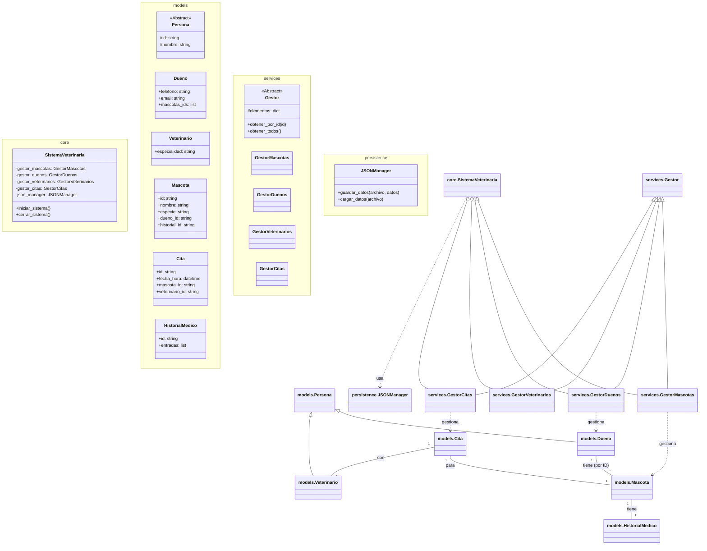

# Alternativa 6

## Construir una aplicación orientada a objetos para la gestión de una veterinaria universitaria utilizando Python.

La aplicación deberá permitir administrar mascotas, dueños, veterinarios, citas e historiales médicos mediante un enfoque de Programación Orientada a Objetos (POO).

El sistema debe emular el funcionamiento básico de una veterinaria universitaria, permitiendo registrar información, consultar historiales clínicos y gestionar citas veterinarias.

---

# Condiciones

- Código original
- Uso de herramientas vistas en el curso (CLASES)
- Interacción y manejo a través de consola (GUI opcional)
- El desarrollo debe realizarse completamente bajo enfoque POO
- El código debe estructurarse en forma de paquete

---

# Operaciones mínimas requeridas

## Gestión de mascotas

La aplicación deberá permitir:

- Registrar mascotas
- Editar información de mascotas
- Eliminar mascotas
- Consultar listado de mascotas registradas

Cada mascota deberá tener atributos como:

- ID
- nombre
- especie
- raza
- edad
- peso
- dueño asociado

---

## Gestión de dueños

La aplicación deberá permitir:

- Registrar dueños
- Asociar mascotas a un dueño
- Consultar mascotas de un dueño

Cada dueño deberá incluir:

- nombre
- teléfono
- correo electrónico
- lista de mascotas

---

## Gestión de veterinarios

La aplicación deberá permitir:

- Registrar veterinarios
- Consultar veterinarios disponibles
- Asignar veterinarios a citas

Cada veterinario deberá incluir:

- nombre
- especialidad
- código interno

---

## Gestión de citas

La aplicación deberá permitir:

- Agendar citas
- Cancelar citas
- Consultar citas programadas
- Registrar estado de la cita

Cada cita deberá incluir:

- fecha
- hora
- mascota asociada
- veterinario asignado
- motivo de consulta
- estado

---

## Historial médico

La aplicación deberá permitir:

- Registrar consultas médicas
- Registrar vacunas
- Registrar tratamientos
- Consultar historial clínico de una mascota

---

# Requisitos de POO

La implementación debe incorporar:

- Clases y objetos
- Herencia
- Encapsulación
- Composición entre entidades
- Métodos especializados para cada entidad

Ejemplos:

- Una mascota pertenece a un dueño
- Una cita relaciona una mascota con un veterinario
- Una mascota posee un historial médico

---

# Persistencia de datos

La aplicación deberá permitir:

- Guardar información en archivos JSON o CSV
- Cargar información previamente almacenada
- Mantener registros entre ejecuciones del programa

---

# Resultados y visualización

La aplicación deberá permitir:

- Mostrar listados organizados
- Consultar información específica
- Mostrar historial médico de mascotas
- Mostrar citas programadas

---

# Features extra

## Reportes

Generar reportes como:

- mascotas registradas
- citas del día
- historial clínico completo
- veterinario con más citas

---

## Estadísticas

Mostrar información como:

- cantidad de mascotas por especie
- número de citas por mes
- tratamientos más frecuentes

---

## Visualización avanzada (Bonus)

- GUI
- Calendario de citas
- Búsqueda avanzada
- Manejo de múltiples usuarios

---

# Referencias sugeridas

- Documentación oficial de Python
- Documentación de JSON y CSV
- Tutoriales de Programación Orientada a Objetos en Python
- Buenas prácticas de modelado orientado a objetos

---

# Ejemplo de estructura del proyecto

```text
pet_manager/
│
├── core/
│   ├── sistema.py
│
├── models/
│   ├── mascota.py
│   ├── dueno.py
│   ├── veterinario.py
│   ├── cita.py
│   ├── historial.py
│
├── services/
│   ├── gestor_mascotas.py
│   ├── gestor_citas.py
│   ├── gestor_reportes.py
│
├── persistence/
│   ├── json_manager.py
│
├── utils/
│   ├── validaciones.py
│
├── main.py
├── requirements.txt
└── README.md
```

---

# Condiciones de entrega

## Entregable final

Se deberá elaborar un repositorio donde se presente:

- Explicación del problema y solución propuesta
- Diagramas UML y diagramas de clases
- Instrucciones de instalación y ejecución
- Estructura organizada como paquete Python
- Archivo `requirements.txt`
- Evidencia del trabajo colaborativo mediante commits y colaboradores

---

# Opcional

- GUI
- Docker
- Manejo de hilos
- Reportes en PDF
- Exportación de datos

---

# Nota

## Avance (15%)

Definición de:

- alcance del proyecto
- diagramas de clases
- estructura preliminar
- demostración funcional inicial

---

## Entrega Final (25%)

Criterios de evaluación:

- Funcionalidad (45%)
- Calidad del repositorio (30%)
- Claridad de la presentación (20%)
- Bonus (5%)

```mermaid
classDiagram
    direction TB

    namespace core {
        class SistemaVeterinaria {
            -gestor_mascotas: GestorMascotas
            -gestor_duenos: GestorDuenos
            -gestor_veterinarios: GestorVeterinarios
            -gestor_citas: GestorCitas
            -json_manager: JSONManager
            +iniciar_sistema()
            +cerrar_sistema()
        }
    }

    namespace models {
        class Persona {
            <<Abstract>>
            #id: string
            #nombre: string
        }
        class Dueno {
            +telefono: string
            +email: string
            +mascotas_ids: list
        }
        class Veterinario {
            +especialidad: string
        }
        class Mascota {
            +id: string
            +nombre: string
            +especie: string
            +dueno_id: string
            +historial_id: string
        }
        class Cita {
            +id: string
            +fecha_hora: datetime
            +mascota_id: string
            +veterinario_id: string
        }
        class HistorialMedico {
            +id: string
            +entradas: list
        }
    }

    namespace services {
        class Gestor {
            <<Abstract>>
            #elementos: dict
            +obtener_por_id(id)
            +obtener_todos()
        }
        class GestorMascotas
        class GestorDuenos
        class GestorVeterinarios
        class GestorCitas
    }

    namespace persistence {
        class JSONManager {
            +guardar_datos(archivo, datos)
            +cargar_datos(archivo)
        }
    }

    models.Persona <|-- models.Dueno
    models.Persona <|-- models.Veterinario
    services.Gestor <|-- services.GestorMascotas
    services.Gestor <|-- services.GestorDuenos
    services.Gestor <|-- services.GestorVeterinarios
    services.Gestor <|-- services.GestorCitas

    core.SistemaVeterinaria o-- services.GestorMascotas
    core.SistemaVeterinaria o-- services.GestorDuenos
    core.SistemaVeterinaria o-- services.GestorVeterinarios
    core.SistemaVeterinaria o-- services.GestorCitas
    
    core.SistemaVeterinaria ..> persistence.JSONManager : usa
    services.GestorDuenos ..> models.Dueno : gestiona
    services.GestorMascotas ..> models.Mascota : gestiona
    services.GestorCitas ..> models.Cita : gestiona
    models.Dueno "1" -- "*" models.Mascota : tiene (por ID)
    models.Cita "1" -- "1" models.Mascota : para
    models.Cita "1" -- "1" models.Veterinario : con
    models.Mascota "1" -- "1" models.HistorialMedico : tiene
```

