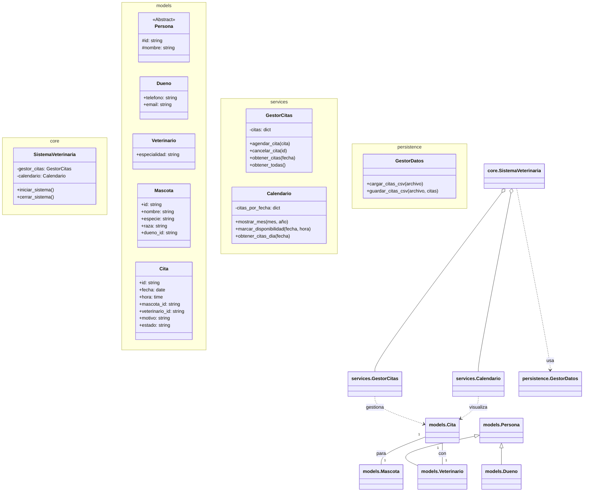

# Ejemplo de estructura del proyecto

```text
pet_manager/
│
├── core/
│   ├── sistema.py
│
├── models/
│   ├── mascota.py
│   ├── dueno.py
│   ├── veterinario.py
│   ├── cita.py
│   ├── historial.py
│
├── services/
│   ├── gestor_mascotas.py
│   ├── gestor_citas.py
│   ├── gestor_reportes.py
│
├── persistence/
│   ├── json_manager.py
│
├── utils/
│   ├── validaciones.py
│
├── main.py
├── requirements.txt
└── README.md
```

---

# UML


```mermaid
classDiagram
    direction TB

    namespace core {
        class SistemaVeterinaria {
            -gestor_citas: GestorCitas
            -calendario: Calendario
            +iniciar_sistema()
            +cerrar_sistema()
        }
    }

    namespace models {
        class Persona {
            <<Abstract>>
            #id: string
            #nombre: string
        }
        class Dueno {
            +telefono: string
            +email: string
        }
        class Veterinario {
            +especialidad: string
        }
        class Mascota {
            +id: string
            +nombre: string
            +especie: string
            +raza: string
            +dueno_id: string
        }
        class Cita {
            +id: string
            +fecha: date
            +hora: time
            +mascota_id: string
            +veterinario_id: string
            +motivo: string
            +estado: string
        }
    }

    namespace services {
        class GestorCitas {
            -citas: dict
            +agendar_cita(cita)
            +cancelar_cita(id)
            +obtener_citas(fecha)
            +obtener_todas()
        }
        class Calendario {
            -citas_por_fecha: dict
            +mostrar_mes(mes, año)
            +marcar_disponibilidad(fecha, hora)
            +obtener_citas_dia(fecha)
        }
    }

    namespace persistence {
        class GestorDatos {
            +cargar_citas_csv(archivo)
            +guardar_citas_csv(archivo, citas)
        }
    }

    models.Persona <|-- models.Dueno
    models.Persona <|-- models.Veterinario

    core.SistemaVeterinaria o-- services.GestorCitas
    core.SistemaVeterinaria o-- services.Calendario
    core.SistemaVeterinaria ..> persistence.GestorDatos : usa
    
    services.GestorCitas ..> models.Cita : gestiona
    services.Calendario ..> models.Cita : visualiza
    models.Cita "1" -- "1" models.Mascota : para
    models.Cita "1" -- "1" models.Veterinario : con
```
````
```text
pet_manager/
│
├── core/
│   ├── __init__.py
│   └── sistema.py                 # SistemaVeterinaria: orquestador central
│
├── models/
│   ├── __init__.py
│   ├── persona.py                 # Clase abstracta Persona
│   ├── dueno.py                   # Clase Dueño (hereda de Persona)
│   ├── veterinario.py             # Clase Veterinario (hereda de Persona)
│   ├── mascota.py                 # Clase Mascota
│   └── cita.py                    # Clase Cita
│
├── services/
│   ├── __init__.py
│   ├── gestor_citas.py            # GestorCitas: gestión de citas (CRUD básico)
│   └── calendario.py              # Calendario: visualización y gestión de disponibilidad
│
├── persistence/
│   ├── __init__.py
│   └── gestor_datos.py            # GestorDatos: lectura/escritura con pandas y CSV
│
├── utils/
│   ├── __init__.py
│   └── validaciones.py            # Funciones de validación (emails, teléfonos, fechas, etc)
│
├── gui/
│   ├── __init__.py
│   ├── ventana_principal.py       # Ventana principal de la aplicación
│   ├── ventana_citas.py           # Interfaz para gestionar citas
│   └── ventana_mascotas_duenos.py # Interfaz para mascotas y dueños
│
├── data/
│   ├── citas.csv                  # Archivo CSV con las citas (persistencia)
│   └── mascotas.csv               # Archivo CSV con las mascotas (persistencia)
│
├── main.py                        # Punto de entrada de la aplicación
├── requirements.txt               # Dependencias del proyecto
└── README.md                      # Documentación principal
````